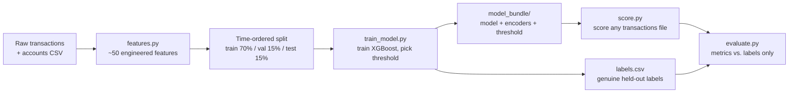

# AML Transaction Detection

A ML project learning to build a model that flags likely money-laundering transactions, using IBM's synthetic AML dataset (~5.08M transactions). Goal was to learn the ML workflow end-to-end.

> **This project is purely for learning and experimentation.** The dataset is synthetic, and the model is not intended for production use or real-world AML decision-making. The goal of this project was to learn the end-to-end machine learning workflow.

## Approach

- **Data**: [IBM Transactions for AML](https://www.kaggle.com/datasets/ealtman2019/ibm-transactions-for-anti-money-laundering-aml) (HI-Small).
- **Features** (`features.py`): ~50 engineered features per transaction, amount/timing patterns, leak-free rolling account history (only using data before each transaction), pairwise sender/receiver history, graph features (PageRank, cycle-closure via NetworkX), entity/bank metadata.
- **Model**: XGBoost.
- **Split**: strict time-ordered train/val/test. Threshold chosen on validation, touched test exactly once.



## The main thing I learned: a good-looking number can be wrong

The biggest lesson of this project was finding out my own evaluation was lying to me in two different ways:

1. **A hidden data leak.** The dataset's last ~8 days (Sept 11-18) turned out to be an entirely different regime, 56-73% laundering rate vs. <0.2% for the rest of the data. Including it in evaluation inflated PR-AUC by ~40%. Fix: restrict train/val/test to the realistic Sept 1-10 window.
2. **Evaluating on data the model had already seen.** Even after fixing #1, a later run scored the model against the *entire* dataset, including the ~85% of rows used to train it. Recall jumped to 97% and looked great, for the wrong reason. Fix: export exactly which rows are the genuine held-out test set at training time, and evaluate only against those.

## Results

Time-ordered split (train 70% / val 15% / test 15%, held-out test never touched during training), evaluated only on the genuine test set:

| Metric | Value |
|---|---|
| PR-AUC | 0.4071 |
| Recall | 86.2% |
| Precision | 5.6% |
| ROC-AUC | 0.987 |
| Alert rate | 1.84% (14,030 alerts / 761,586 transactions) |

Precision is low, but the top of the ranking is strong, the 20 highest-risk transactions were all true positives.

## Running it

```bash
python train_model.py --alert-budget 0.01  # trains + exports model_bundle/ and outputs/labels.csv
python score.py # scores transactions, writes outputs/scored_transactions.csv
python evaluate.py # evaluates against the held-out set (default)
```